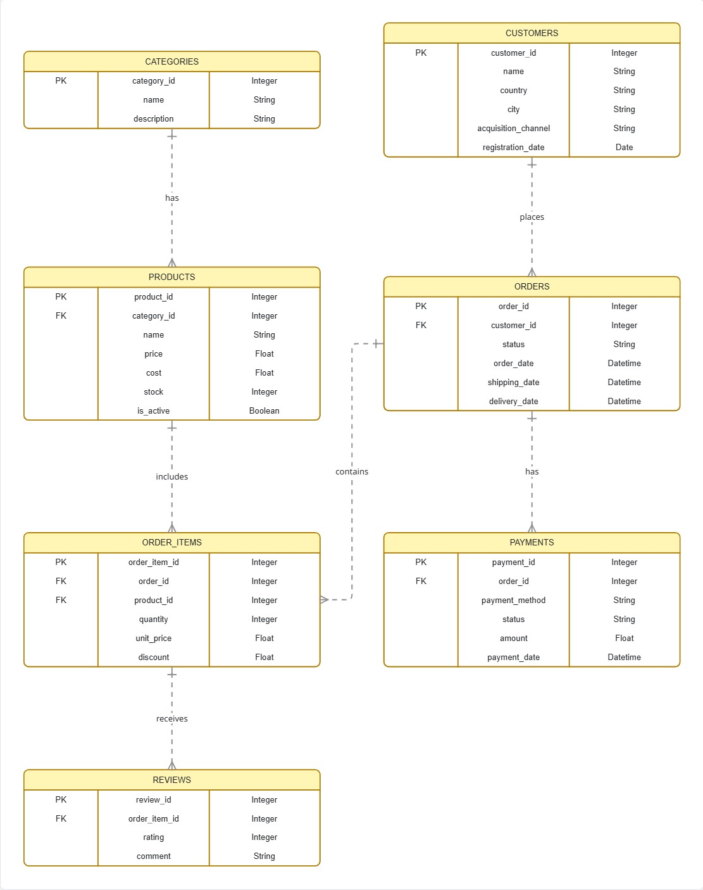

# 🛒 E-commerce BigQuery Data Pipeline & 3NF Schema

Proyecto analítico de ingeniería de datos para la gestión y modelado de un e-commerce, integrado con **Google BigQuery**, modelado en **Tercera Forma Normal (3NF)**, poblado con datos sintéticos realistas mediante **Faker** y validado con consultas analíticas de negocio.

---

## Arquitectura de Datos

El diseño de nuestra base de datos sigue un modelo relacional en 3NF para garantizar la integridad y eficiencia de los datos en BigQuery.

### Diagrama Entidad-Relación (ERD)



El esquema actual comprende las siguientes entidades:

- **Categorías y Productos**: Gestión de inventario.
- **Clientes**: Datos demográficos y canales de adquisición.
- **Órdenes y Detalles**: Registro transaccional completo.
- **Pagos y Reseñas**: Seguimiento financiero y feedback.

---

## 📂 Estructura del Repositorio

```text
ecommerce_bigquery/
├── credentials/
│   └── service-account.json  # (Ignorado por Git) Credenciales de GCP
├── data/                     # Archivos de datos locales opcionales
├── docs/
│   └── er_diagram.png        # Diagrama de Entidad-Relación (3NF)
├── src/
│   ├── __init__.py
│   ├── config.py             # Configuración y cliente de BigQuery
│   ├── create_tables.py      # Creación de tablas normalizadas
│   ├── generate_data.py      # Generación de datos sintéticos (Faker)
│   ├── load_data.py          # Carga masiva a BigQuery
│   └── queries.py            # Queries de verificación analítica
├── .env.example              # Plantilla de variables de entorno
├── .gitignore
├── README.md
├── requirements.txt
└── seed.py                   # Script maestro de inicialización
```

## 📐 Modelo de Datos (3NF)

El modelo consta de 7 tablas normalizadas para evitar redundancias y anomalías de actualización:

categories: Categorías de productos.

products: Catálogo de productos (con costes y precios).

customers: Datos demográficos y de adquisición de clientes.

orders: Transacciones de pedidos y sus estados.

order_items: Líneas de pedido (contiene snapshot del unit_price histórico).

payments: Transacciones de pago asociadas a los pedidos.

reviews: Valoraciones de productos entregados.

(Ver diagrama completo en docs/diagramabigquery.jpg)

## ⚙️ Configuración e Instalación

1. Clonar el repositorio y crear entorno virtual

```powershell
git clone [https://github.com/AleDataAnalyst/ecommerce_bigquery.git](https://github.com/AleDataAnalyst/ecommerce_bigquery.git)
cd ecommerce_bigquery
python -m venv venv
.\venv\Scripts\Activate.ps1
```

2. Instalar dependencias

```powershell
pip install -r requirements.txt
```

3. Configurar Credenciales y Entorno
   Coloca tu archivo JSON de la Service Account de Google Cloud en: credentials/service-account.json.

Crear un archivo .env en la raíz basado en .env.example:

```python
GCP_PROJECT_ID=tu-proyecto-real
BQ_DATASET_ID=challenge_ecommercebigquery
GOOGLE_APPLICATION_CREDENTIALS=./credentials/service-account.json
```

## 🚀 Ejecución (Seeding)

Para crear el dataset, las tablas, generar los datos sintéticos con Faker y cargarlos automáticamente en BigQuery, ejecuta el script maestro:

```powershell
python seed.py
```

📊 Consultas Analíticas de Verificación
Para ejecutar las métricas y validaciones del negocio sobre BigQuery:

```powershell
python src/queries.py
```
